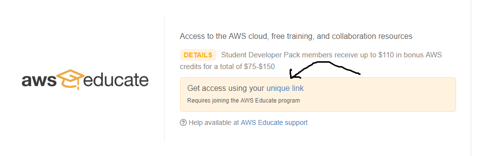
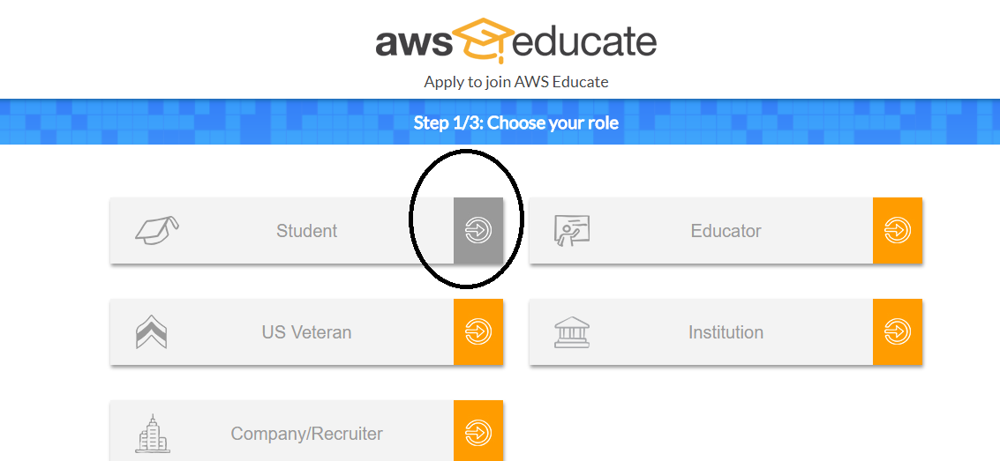
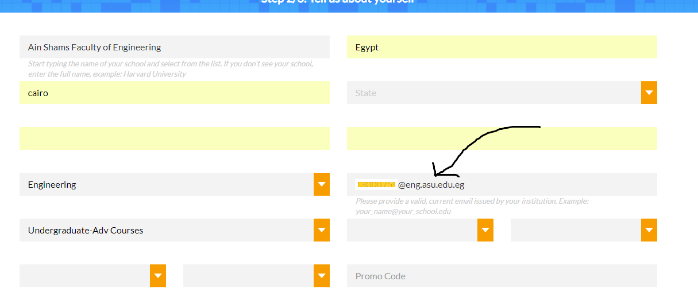
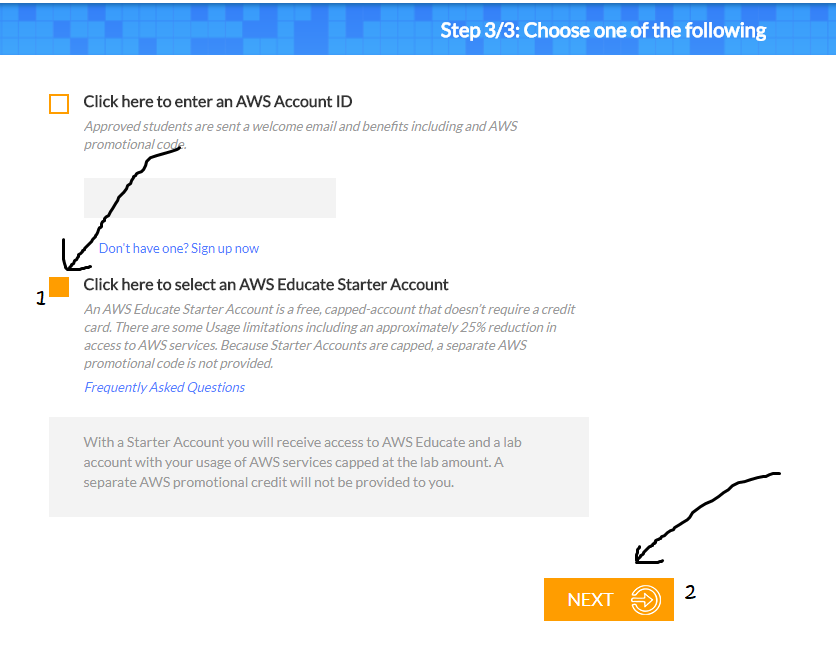
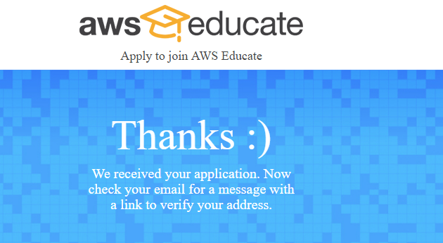
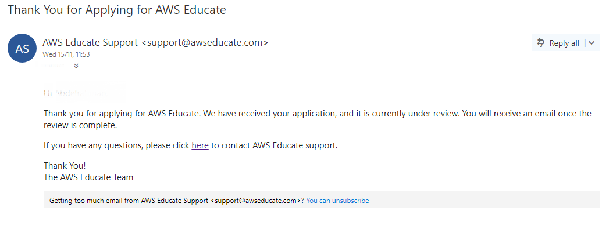
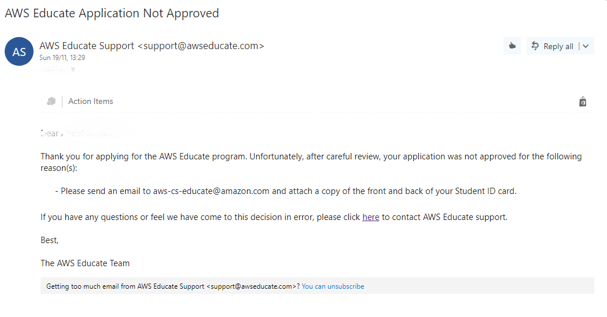
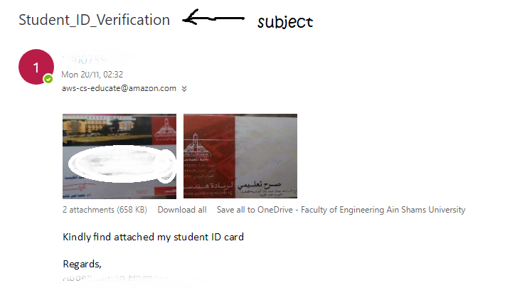
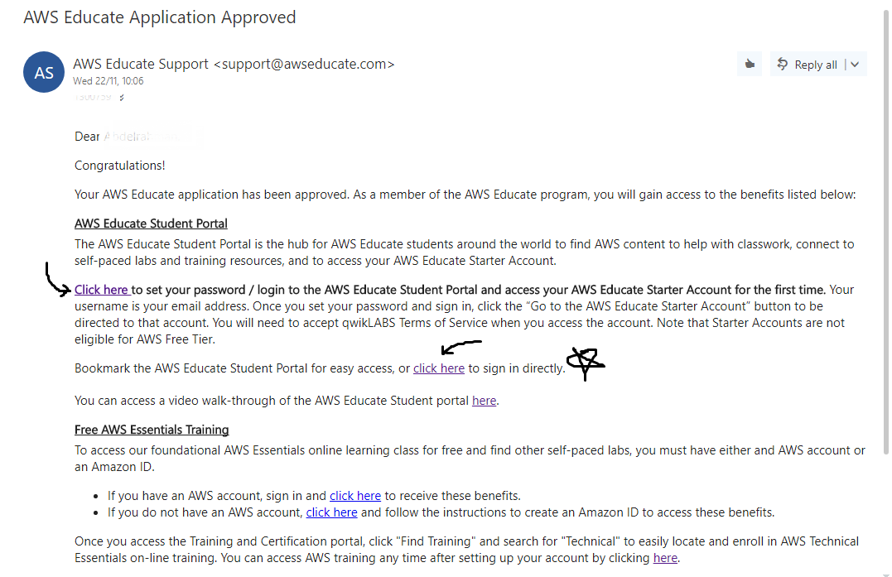
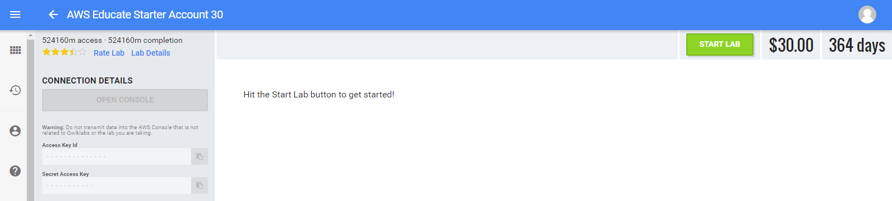

## AWS student subscription \[$75 valued\]

> For the `$75` valued email, **you need github student developer pack**, which you can get from [HERE](https://education.github.com/pack). **Otherwise** you will need to register from [here](https://www.awseducate.com/registration) which will get you the `$30` valued subscription

+ Go to your github [developer pack](https://education.github.com/pack/offers#aws-educate) and select your *unique link* this is just a registration link with some promo code  
+ Now select *student* as your role    

+ Fill all the information and enter **your university email**    
+ On the next page make sure to select the second option *AWS educate starter account*    
+ If everything is ok you should see something like the following    

+ Now check your email  

### Post registration

+ It usually takes from 2\~5 days till they reply, so keep checking your email
+ **Sometimes** you might receive an email stating that your application is not accepted  
    + In such case you should send an email to `aws-cs-educate@amazon.com` with both sides of your ID attached  
+ If everything is ok, you should receive an email like this  

+ Now create your password and you should end up in a page like the following  
+ In case you are signing up from the github dev. pack, you should see `$75` instead of `$30`