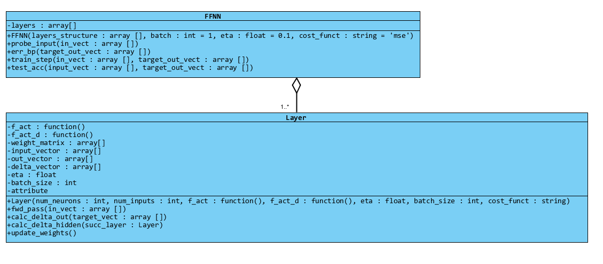
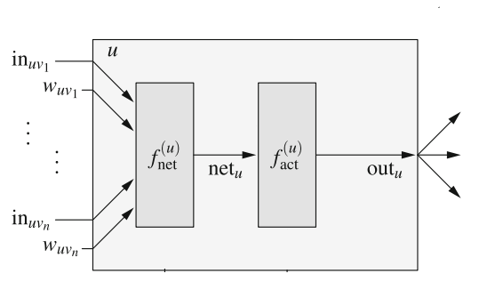
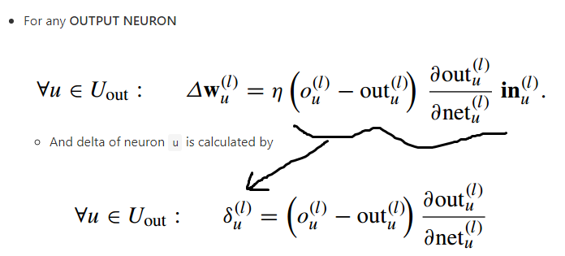
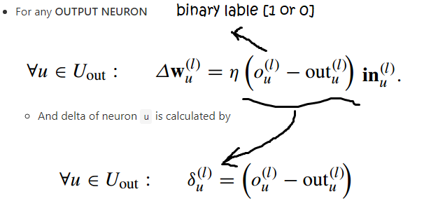
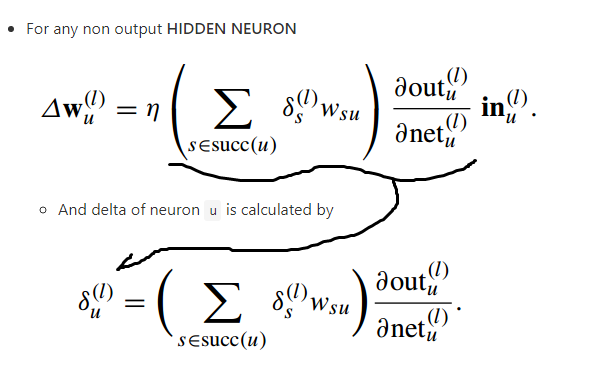
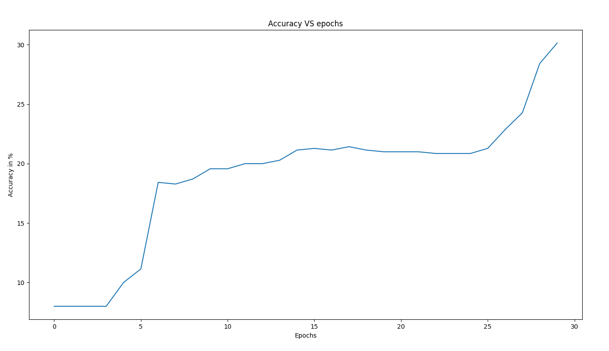

## `FFNN` class

The class `FFNN` implements a feed-forward neural network, the class is flexible and allows any activation function and any derivate per layer. 

The class also relies on the `Layer` class that represent  separate layer object. The overall class diagram for the neural network can be represented as the following



### Class features
+ Full vector operations : the class makes use of all `numpy` based matrix vector operations
+ Supports mean squared error and cross-entropy with output `softmax()` as cost function
+ Supports batch operations \[vectorized\]
+ Features a flexible number of fully connected stack of layers given at instantiation time
+ Each layer can have its own activation function for flexibility 

### Notation used inside the code

A neuron is defined as the following block



Such that

+ `In` : the input coming from a previous layer
+ `W` : weight 
+ `F_net` : the multiply-accumulate function i.e. `W*IN`
+ `NET_u` : dot product scaler result that will be then given to the non-linear activation function
+ `f_act` : the nonlinear activation function of a neuron


### Back-propagation rules


The output layer update rule for the **mean squared error** is defined as the following



+ `L` : a training example out of the data set
+ `o_u` : the label from the data set for the item `L`
+ `out_u` : the output neuron output for the current input
+ `d(out_u)/d(net_u)` : the derivative of the neuron output w.r.t the scaler `net_u` i.e. the derivative of the activation function

and for the cross-entropy with `softmax` as output activation function the output layer update rules are



and for the hidden neurons the update rule is fixed whatever the loss function was, it is defined by the following rule



At the `Layer.py` class implementation the update rules are

The delta term for the output layer is calculated by the following code section

```python
def calc_delta_out(self, target_vect):
    if self.cost_funct == 'mse':
        # mean squared error output delta calculation
        self.delta_vector = (target_vect - self.out_vector)*self.f_act_d(self.net)
    elif self.cost_funct == 'ce':
        # cross entropy error output delta calculation
        self.delta_vector = (target_vect - self.out_vector)
```

and for the hidden layers

```python
def calc_delta_hidden(self, succ_layer):
    """
    Calculate the delta terms of the hidden layers
    ### args
    - past_layer : the succ. layer object
    """
    self.delta_vector = np.dot(succ_layer.weight_matrix[:, 1:].T,
                                succ_layer.delta_vector)*self.f_act_d(self.net)

```

And the weight update rule for any neuron is calculated by the following code section

```python
def update_weights(self):
    """
    updates all the weights of the neural network
    """
    # broadcast
    # Sum the inputs in case of batch training
    self.weight_matrix += 1.0/self.batch_size*self.eta*np.dot(self.delta_vector, self.input_vector.T)
```

Notice `self.weight_matrix +=` since all the delta terms are flipped to ensure they are already negative when multiplied


### Testing the neural network against `Cifar-10`

A neural network is defined by the following parameters

```python
TRAIN_SIZE = 7000
TEST_SIZE = 700
# Train for 30 epochs
EPOCHS = 30
# each iteration use a batch of 2 items
BATCH_SIZE = 2
# learning rate 1e-2
LR = 1e-2 

# create NN object with 2 hidden layers each with 50 neurons
NN = FFNN([3072, 50, 50, 10], batch=BATCH_SIZE, eta=LR, cost_funct='ce')
```

The network accuracy output is shown in the next drawing



Notice an accuracy of **30.142%** is achieved with this neural network.

The code is listed below